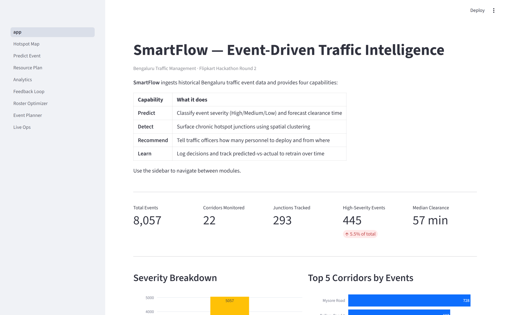
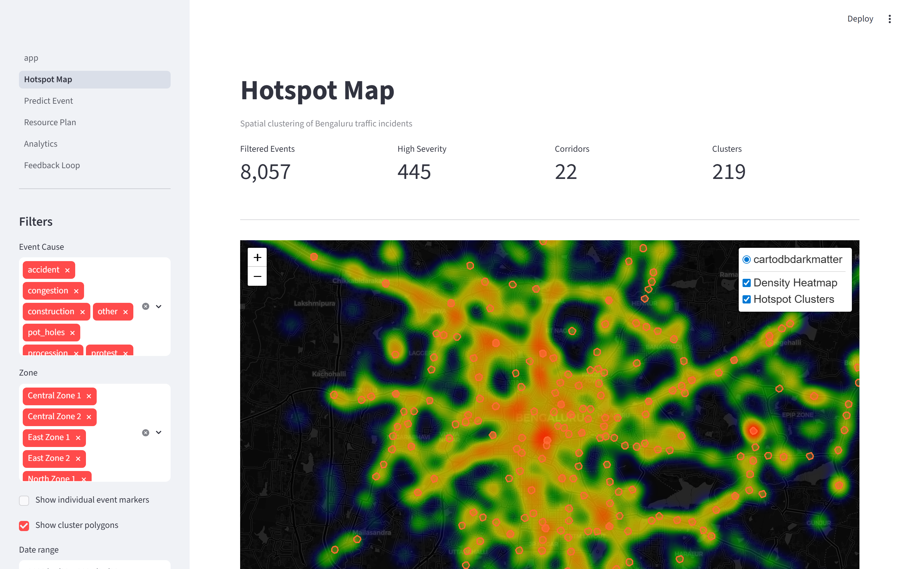
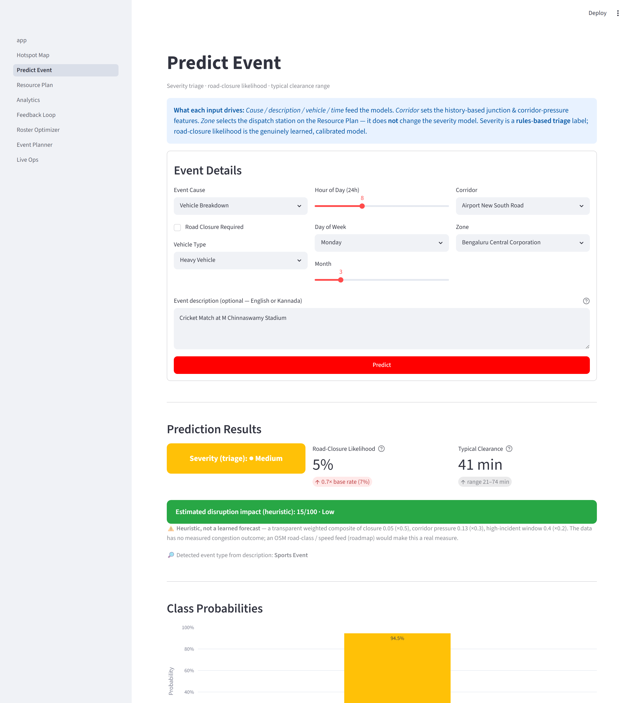
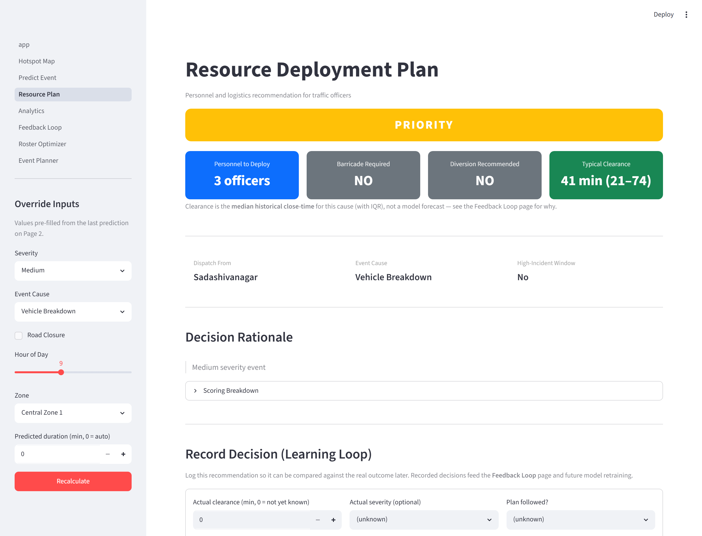
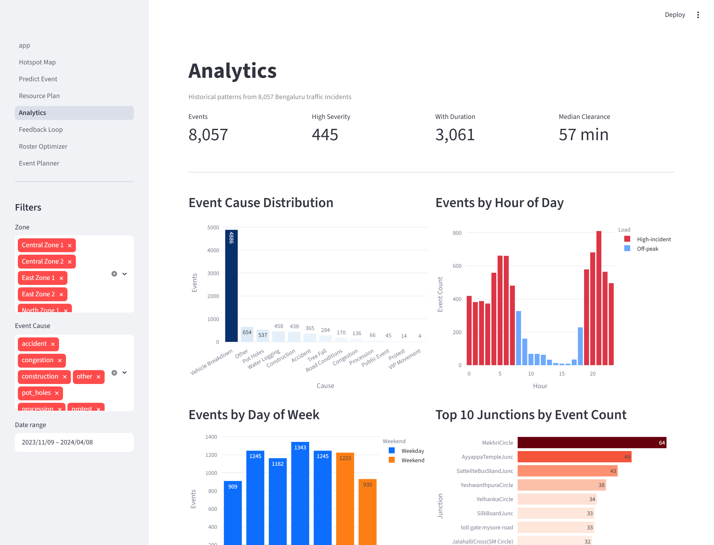
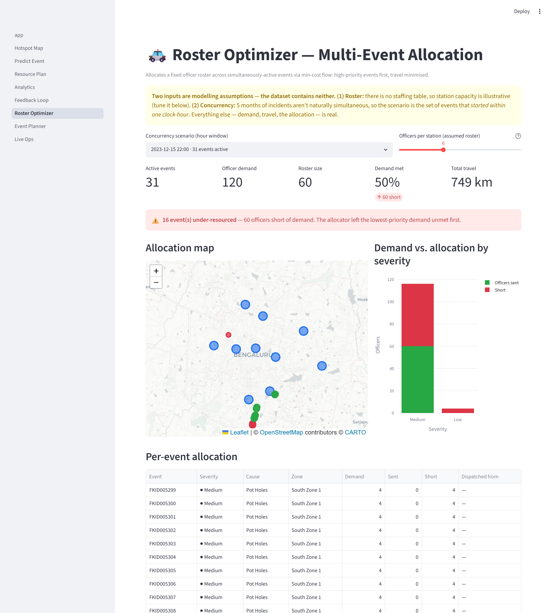
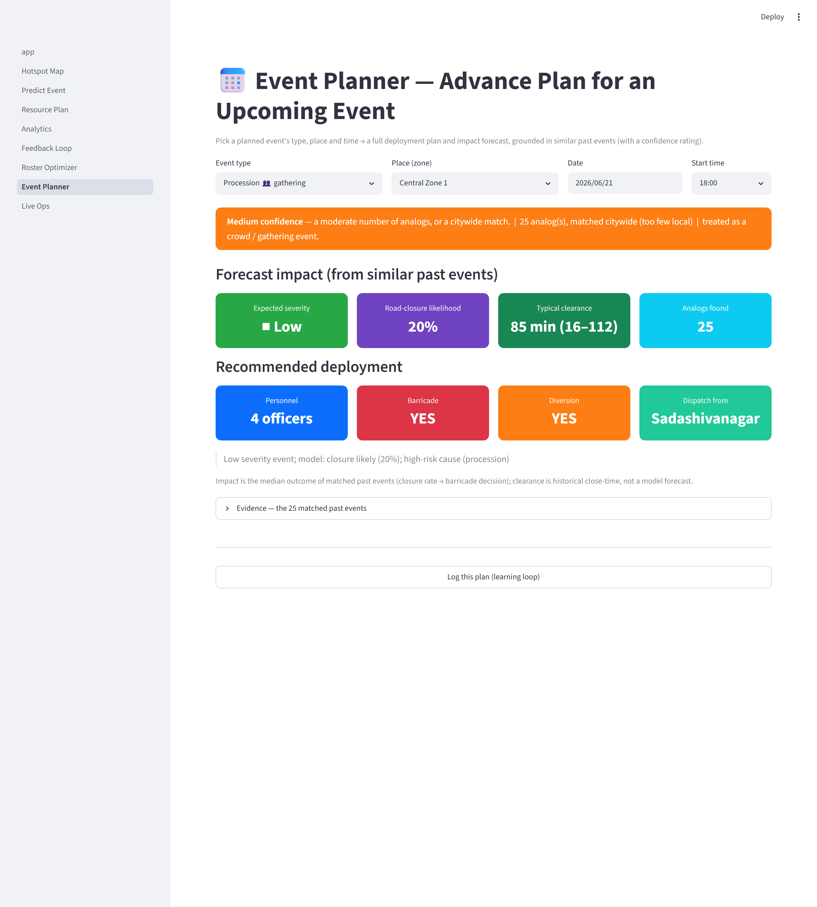

# SmartFlow — Event-Driven Traffic Intelligence Platform

> Flipkart Hackathon Round 2 | Intelligent Traffic Management System for Bengaluru

---

## Dashboard Preview

| Home — KPIs & Charts | Hotspot Map |
|---|---|
|  |  |

| Predict Event + SHAP | Resource Plan |
|---|---|
|  |  |

| Analytics | Roster Optimizer |
|---|---|
|  |  |

| Event Planner |
|---|
|  |

---

## Problem

Bengaluru processes thousands of road incidents every month — accidents, floods, vehicle breakdowns, construction blocks. For Flipkart's last-mile logistics, each undetected hotspot or delayed response costs delivery SLA time and fleet efficiency. Operators currently lack a unified system to predict incident severity, identify recurring hotspots, and deploy resources before queues form.

---

## Approach — two layers, scoped to what the data supports

The brief spans two distinct regimes, and so does this dataset. Rather than build one model that pretends they're the same problem, SmartFlow is **explicitly two layers**:

- **Layer A — Background Incident Operations** (≈92% of the data: vehicle breakdowns, potholes, water-logging). These are *reactive*: an incident is logged, then triaged and cleared. This layer does real-time triage, hotspot detection, **road-closure prediction** (the headline model — a real observed target), and resource dispatch.
- **Layer B — Planned-Event Impact** (≈8%: `public_event`, `procession`, `vip_movement`, `protest`, plus `construction`). These have a known type, place, and time *ahead of time*, so they're handled by **case-based retrieval** — pull the most similar past events and surface what they actually required — rather than a deep learned forecaster the ~130 gathering rows can't support.

This split is a deliberate scoping choice, not a limitation we're hiding: the dataset is incident-heavy, so we make the incident layer genuinely operational and answer the planned-event half with honest case-based evidence. Where the brief asks for a measured *congestion impact* (queue length, speed drop), the data contains none — see [Honest Limitations](#honest-limitations).

---

## Solution

SmartFlow is built on 8,057 real Bengaluru traffic incidents (Astram dataset, cleaned from 8,173 raw rows):

| Module | What it does |
|---|---|
| **Data Pipeline** | Cleans raw Astram CSV — null handling, timestamps normalised to naive Bengaluru-local time at ingestion (the `+00` tag was never truly UTC — see Design Decisions), event-aware cause vocabulary (procession / VIP / protest kept as first-class causes) |
| **ML Models** | **Road-closure predictor** (calibrated, ROC-AUC ≈0.70 on a *real observed* target) + severity triage classifier (75.1% chronological holdout vs 63.2% baseline) |
| **Free-text Mining** | Bilingual (English + Kannada) keyword pass over `description` → event semantic type (sports event, utility work, VIP movement, …) |
| **Hotspot Engine** | DBSCAN spatial clustering (219 clusters, config-driven 200 m radius) + KDE density heatmap |
| **Resource Recommender** | Config-driven scoring → personnel, barricade, diversion, dispatch station + empirical clearance range |
| **Roster Optimizer** | Min-cost-flow allocation of a fixed officer roster across simultaneous events — high-priority first, travel minimised (the *optimal* in "optimal deployment") |
| **Event Planner** | Advance what-if for a known upcoming event (type + place + date/time) → impact forecast + full deployment plan, grounded in similar past events with a confidence rating |
| **Case-Based Forecast** | Retrieves similar past events (graceful backoff: nearby → type-in-zone → type-citywide → similar) and what they actually required, with a confidence tier |
| **Feedback Loop** | Logs each decision, tracks predicted-vs-actual, and **closes the loop**: `learning_loop.py` re-fits and records a drift snapshot to `metrics_history.csv` |
| **Real-time API** | `POST /event` (FastAPI) runs the same predict → recommend → log path for streaming use |

---

## Key Metrics

| Metric | Value |
|---|---|
| Events processed | 8,057 (from 8,173 raw) |
| **Road-closure model ROC-AUC** (real observed target, calibrated) | **0.695** (PR-AUC 0.17, recall 0.06 / precision 0.44 @0.5) vs 7.4% base rate |
| Severity triage accuracy (chronological holdout) | 75.1% — vs 63.2% majority baseline |
| Severity triage accuracy (random 5-fold CV) | 86.1% (optimistic — ignores time order) |
| Clearance predictor vs median baseline | 106.9 min — **no lift over the median** (reported honestly) |
| Median incident clearance | 57 min |
| Hotspot clusters found | 219 |
| Top hotspot | Sankey Road — 764 events |

> **Which model is the "real" one?** The **road-closure predictor** is — it
> learns a genuinely *observed* outcome (`requires_road_closure`) and is
> calibrated, so its probability is trustworthy. Severity is a *rules-based
> triage* label (priority + closure + cause), so its classifier is framed as
> triage, not impact prediction. The clearance regressor does **not** beat a
> naive median, so we show it as an empirical range, not a forecast.

---

## Dashboard Pages

1. **Home** — KPI metrics, severity distribution, top corridors
2. **Hotspot Map** — Folium heatmap + DBSCAN cluster circles with tooltips
3. **Predict Event** — Severity triage + **calibrated road-closure likelihood** + typical clearance range + SHAP + live text mining
4. **Resource Plan** — Deployment recommendation, **case-based analog panel** for planned events, decision logging
5. **Analytics** — 7 Plotly charts (incl. free-text event type)
6. **Feedback Loop** — Predicted-vs-actual backtest (with median baseline) + live operator decision log
7. **Roster Optimizer** — Multi-event conflict view: allocate a fixed officer roster across simultaneously-active events (min-cost flow), with under-resourced events flagged
8. **Event Planner** — Advance what-if simulator: pick an upcoming event's type, place and date/time → full deployment plan + impact forecast + analog evidence, in one pane

---

## Project Structure

```
smartflow/
├── src/
│   ├── data_pipeline.py       # Load & clean raw CSV
│   ├── feature_engineering.py # Features + bilingual text mining
│   ├── model_training.py      # Closure predictor, severity triage, clearance stats
│   ├── hotspot_engine.py      # DBSCAN + KDE + GeoJSON (config-driven)
│   ├── resource_recommender.py# Config-driven per-event deployment logic
│   ├── roster_optimizer.py    # Min-cost-flow allocation across concurrent events
│   ├── event_analog.py        # Case-based retrieval (backoff + confidence)
│   ├── event_planner.py       # Advance plan for an upcoming event (impact + deployment)
│   ├── history_features.py    # Backward-looking history lookup for inference
│   ├── outcomes_log.py        # Decision/outcome log (append-only CSV)
│   ├── learning_loop.py       # Closes the loop: retrain + metrics_history drift
│   └── utils.py               # Zone/station mappings, constants
├── dashboard/
│   ├── app.py                 # Home page
│   └── pages/
│       ├── 1_Hotspot_Map.py
│       ├── 2_Predict_Event.py
│       ├── 3_Resource_Plan.py
│       ├── 4_Analytics.py
│       ├── 5_Feedback_Loop.py
│       ├── 6_Roster_Optimizer.py
│       └── 7_Event_Planner.py
├── api/
│   └── main.py                # FastAPI real-time endpoint
├── tests/
│   ├── test_leakage.py        # Asserts history features are backward-looking
│   ├── test_history_features.py # Asserts inference uses real history, not a constant
│   ├── test_roster_optimizer.py # Asserts allocation conserves demand & triages by priority
│   ├── test_event_planner.py  # Asserts confidence backoff & obstruction handling
│   └── test_learning_loop.py  # Asserts the loop reads outcomes back & records drift
├── data/
│   ├── raw/                   # Place events.csv here
│   └── processed/             # Auto-generated outputs
├── models/                    # Trained .pkl files
├── .github/workflows/ci.yml   # CI: pytest + Docker build on push/PR
├── Dockerfile                 # Dashboard container (out-of-the-box demo)
├── config.yaml               # Single source of truth (wired into code)
└── requirements.txt
```

---

## Instructions to Run

### 1. Prerequisites

- Python 3.10 or higher (tested on 3.13)
- The raw Astram events CSV (`events.csv`) placed in `data/raw/`

### 2. Install dependencies

```bash
cd smartflow
pip install --prefer-binary -r requirements.txt
pip install shap --prefer-binary
```

### 3. Run the data pipeline

```bash
python src/data_pipeline.py
python src/feature_engineering.py
```

### 4. Train the ML models

```bash
python src/model_training.py
```

### 5. Generate hotspot data

```bash
python src/hotspot_engine.py
```

### 6. Launch the dashboard

```bash
streamlit run dashboard/app.py
```

Open [http://localhost:8501](http://localhost:8501) in your browser.

> **Quick start (all steps in one):** The dashboard auto-runs the pipeline on first load if processed files are missing. Just run `streamlit run dashboard/app.py` after placing `events.csv` in `data/raw/`.

### Run with Docker

The processed data and trained models are committed, so the dashboard runs out of the box — no raw CSV or training step needed:

```bash
docker build -t smartflow .
docker run -p 8501:8501 smartflow      # → http://localhost:8501
```

### Tests & CI

```bash
pytest tests/        # 15 tests: leakage, history lookup, optimizer, planner, learning loop
```

[GitHub Actions](.github/workflows/ci.yml) runs the test suite **and** a Docker image build on every push / PR.

---

## Tech Stack

| Layer | Technology |
|---|---|
| Data processing | pandas, numpy, scipy |
| Machine learning | XGBoost, scikit-learn |
| Spatial analysis | DBSCAN (sklearn, haversine), KDE (scipy) |
| Explainability | SHAP (TreeExplainer, waterfall chart) |
| Calibration | scikit-learn (isotonic) for the closure model |
| Dashboard / API | Streamlit, Plotly, Folium / FastAPI |
| Config | PyYAML (wired into the code, not decorative) |

---

## Design Decisions

- **The real model predicts a real target: road closure.** `requires_road_closure` is *observed* (not a derived label) and is exactly what drives barricading/diversion — so it is genuinely learnable and operationally meaningful. We predict it with a class-weighted, **isotonic-calibrated** XGBoost on a chronological split. At a 7.4% base rate, accuracy is meaningless, so we report **ROC-AUC 0.70 / PR-AUC** and present the calibrated probability against the base rate. This is the headline model, replacing the synthetic-label classifier as the thing to trust.
- **Severity is a triage classifier, not a congestion-impact predictor** — its label is rules-derived (priority + closure + cause) and real-world impact (queue length, delay) is never measured in this data. So it is framed as *triage*. The honest result still stands: **75.5% on a chronological holdout vs a 63% baseline** from spatial-temporal context alone.
- **Contextual-only severity features (no leakage, no text)** — cause/closure are excluded because the label is derived from them; the text-derived `event_semantic_type` is *also* excluded from the classifier because it is a cause-proxy that would re-introduce the same circularity. It is used only by the duration model, where cause-like features are legitimate.
- **Chronological validation, not random** — operational forecasting must train on the past and predict the future. We split by time (earlier 80% / later 20%) instead of a random split. This is why the headline accuracy (75.1%) is lower than the conventional random CV (86.1%) — and more trustworthy.
- **`month` dropped as a feature** — coverage is only **Nov 2023–Apr 2024 (~5 months)**, so under a chronological split the test months barely appear in training: `month` can't learn seasonality from this window and acts as a mild leak. We verified removal is neutral-to-positive — severity accuracy held (0.754 → 0.751) and the closure model's minority-class metrics *improved* (PR-AUC 0.16 → 0.17, recall 0.02 → 0.06, precision 0.20 → 0.44) — so it's gone from all three models.
- **Leakage-free junction history** — `junction_repeat_count` counts only events that occurred *before* each event at the same junction (an expanding count), zeroed for the catch-all "unknown" junction so it can't act as a disguised time index.
- **Inference uses real history, not a fabricated constant** — a new event has no `junction_repeat_count` / `corridor_7d_score` of its own, and these features *do* move the prediction. Earlier code fed a hardcoded `5`, so every live prediction depended on a made-up value. Both the Predict page and the API now look these up from the corridor's **historical medians** (global-median fallback for unknown corridors) via one shared `history_features` module; an explicit override is still accepted for when a real event store can supply a live count. This is a typical-rate proxy, not a live count — a true live store is on the roadmap.
- **Timezone normalised once at ingestion; "high-incident window" is data-derived, not assumed.** The raw timestamps carry a `+00` tag, but their wall-clock already behaves as Bengaluru **local** time: converting to IST empties the evening rush (18–21h drops to ~8–52 events) and invents a 2 AM peak. So the pipeline strips the misleading tag **once, at ingestion** (`data_pipeline._parse_datetimes` → naive local), and every downstream consumer works in plain local time — no per-file tz juggling and nobody tempted to "correct" a UTC tag that was never truly UTC. And because this feed is ~60% truck breakdowns, incident volume peaks in the **freight window (evening + pre-dawn)**, *not* the textbook 08–10 / 17–20 commuter rush. So the high-incident window is defined **from the data** (hours whose volume exceeds the daily mean), lives in `config.yaml`, and is shared by training, the recommender, the API and the dashboard through one helper. The user-facing label is **"high-incident window"**, not "peak hour", so an operator doesn't misread it as commuter rush. (Measured honestly: the `is_peak_hour` flag is redundant with raw `hour_of_day` for the models — closure AUC unchanged at 0.695 — so its real value is the recommender's personnel bonus now firing on the actual load pattern, e.g. a 21:00 incident, not the wrong commuter hours.)
- **Event-aware cause vocabulary** — `procession`, `vip_movement`, `protest`, `public_event` are kept as first-class causes rather than collapsed into "other", because planned/unplanned gatherings are exactly the event types this problem targets.
- **Free-text mining (English + Kannada)** — the `description` field (83% populated, bilingual) is mined with a keyword pass into an `event_semantic_type` (sports event, utility work, VIP movement, …). It powers the auto-categorisation chart in Analytics and the live extraction on the Predict page. **We measured its effect honestly: it does *not* improve clearance-time MAE** (see below) — but it recovers event semantics the structured cause column misses.
- **The clearance regressor is reported against its baseline** — on the chronological holdout the XGBoost MAE (~106 min) is **statistically indistinguishable from "always predict the median" (~106 min)**. Clearance time here is dominated by unobserved operational factors (crew dispatch, on-scene complexity), so we present the estimate as a rough prior, show the baseline beside it on the Feedback Loop page, and have the Resource Plan fall back to cause-based medians. We'd rather show this than dress up a constant as a model.
- **Planned events get a case-based forecast, not a model** — processions, VIP movement, protests and public events have a known type and place ahead of time. The **Event Planner** page turns that into a single advance what-if: pick type + place + date/time and get the impact forecast (expected severity, road-closure likelihood, clearance range) *and* the deployment plan (personnel, barricade, diversion, dispatch) in one pane, before the event. It directly answers the "recommend manpower for an upcoming event" half of the brief without inventing a model the ~130 gathering rows can't support.
- **Retrieval backs off gracefully and rates its own confidence** — a query keys on *type-and-place*, but ~15 protests citywide means an exact local match can return nothing. So retrieval degrades **nearby → type-in-zone → type-citywide → similar-events**, surfaces how many analogs it found, and labels the result **high / medium / low confidence** so a thin match reads as a rough prior, not a confident answer on one data point. **Construction is handled as its own sub-case** — a sustained obstruction, not a crowd — so it doesn't inherit crowd-control personnel logic.
- **"Optimal" deployment is an actual optimisation, not a scoring table** — the per-event recommender says how many officers *one* event needs; it can't resolve the real constraint, which is scarce officers across *simultaneous* events. The Roster Optimizer models that as a **min-cost flow**: a fixed roster (station capacities) flows to events at a cost of travel distance, with a severity-weighted penalty path for unmet demand. The result minimises travel while serving high-priority events first, and leaves the lowest-priority demand short when the roster can't cover everything — a genuine "optimal given the constraints" plan. Two inputs are assumed and labelled as such (roster capacity and the concurrency scenario — see Limitations); everything else (demand, travel, allocation) is real.
- **Config is the single source of truth** — `config.yaml` is read by the hotspot engine (DBSCAN eps, min samples, KDE bandwidth, cluster radius) and the resource recommender (personnel, bonuses, barricade causes, closure threshold, **data-derived peak hours**). It is no longer decorative; change the file and behaviour changes.
- **Honest cluster footprints** — clusters render as fixed-radius circles around the centroid, not convex hulls. Hulls over road-aligned incidents produce giant triangles that overstate the affected area.
- **DBSCAN over k-means** — no need to pre-specify cluster count; naturally handles noise; 200 m haversine radius tuned to Bengaluru block size.
- **Median over mean for clearance** — 9.7% of tickets were never properly closed, inflating the mean to 552 min. Median (57 min) reflects real operational close-time.
- **The post-event learning loop is closed in code, not just logged** — the brief names "no post-event learning system" as a core pain. Logging alone is an open loop, so `learning_loop.py` reads `decisions_log.csv` back to measure recommendation-vs-actual accuracy (clearance MAE + severity accuracy), re-fits the models, and appends a snapshot to `metrics_history.csv`. Run on a schedule, that file makes **drift across retrains** visible on the Feedback Loop page — the difference between a loop that's real and one that's merely scaffolded. (Honest scope: the re-fit reads the canonical feature set, which grows as the pipeline ingests resolved events; a raw log row lacks the engineered features to train on directly.)

---

## Honest Limitations

We'd rather state these than have a reviewer find them:

- **Dataset is incident-heavy.** ~92% of records are incidents (vehicle breakdowns, potholes, water-logging). True event/gathering rows (procession, VIP, protest, public event) are ~130 events. SmartFlow surfaces them as first-class, but the data can't support a deep event-specific forecaster yet.
- **No measured congestion outcome.** The dataset records no queue length, speed drop, or delay. "Severity" is a rules-derived label, not an observed impact — so the classifier is framed as *triage*, and the only genuine outcome we model is **clearance time** (`duration_minutes`).
- **Clearance is mostly clerical, and unpredictable from these features.** Of ~2,760 usable durations, only **69** come from a real `resolved_datetime`; ~2,460 come from `closed_datetime`, an administrative ticket-close that is often batched. So the target is largely paperwork timing — which is why no regressor beats the median, and why we present clearance as an empirical range labelled "close-time", not "time to clear".
- **No measured congestion impact.** The data has no queue length, speed drop, or delay — so true "event impact forecasting" is structurally impossible from this CSV alone. It would need an external signal (OSM road class / lane count, or a typical-speed feed); that join is future work, not faked here.
- **Seasonality blind spot.** Coverage is roughly **Nov–Apr only** — it misses the Jun–Sep monsoon when water-logging and tree-fall spike. Any generalisation claim should be fenced to the non-monsoon window.
- **`comment` field is empty (0%); `description` is noisy.** Only `description` carries signal, and ~36% of descriptions are too short/generic ("Starting problem", "no") to classify.
- **Closure model is modest.** ROC-AUC 0.70 is a real signal but not a strong classifier; at a 7.4% base rate recall at the 0.5 threshold is low, so it is used as a *likelihood/ranking* signal, not a hard yes/no.
- **Moran's I is optional.** It needs `esda`/`libpysal`, which aren't in the core install, so the "clusters are statistically significant" check silently skips in most environments.
- **The roster optimizer rests on two assumed inputs.** The dataset has no officer roster or station capacity, so the supply side is illustrative (configurable). And 5 months of incidents aren't naturally simultaneous, so concurrency is *constructed* — the events that started within one clock-hour. The allocation maths is real; the scenario it runs on is a scaffold for demonstration, not a live operational feed. Station locations are themselves derived (centroid of the events each station serves), since the data has no station coordinates.

---

## Roadmap

- External impact signal (OSM lane count / typical-speed feed) so a closure on an 8-lane arterial scores differently from a side street — the missing piece for true impact forecasting
- Schedule `learning_loop.py` (cron) and auto-ingest newly-resolved logged events into the feature set — the loop is now closed in code (retrain + `metrics_history.csv` drift tracking); what remains is automating the cadence
- Stronger multilingual text models (embeddings) over `description`
- Extend coverage across the monsoon season
